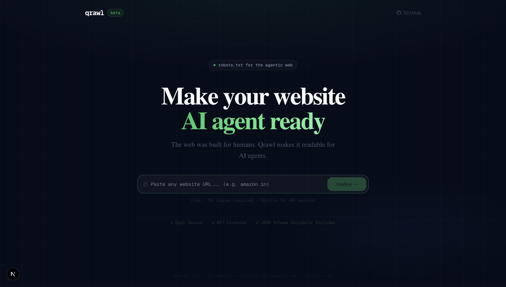
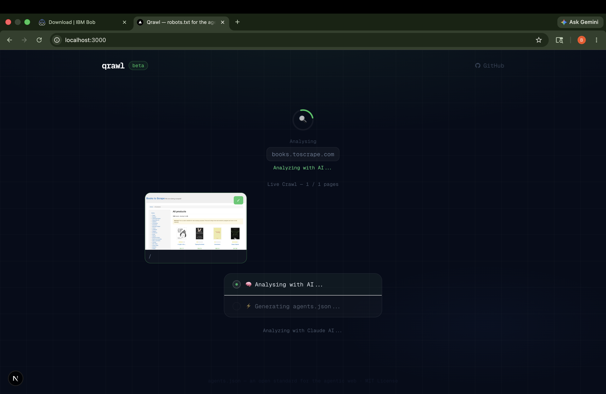
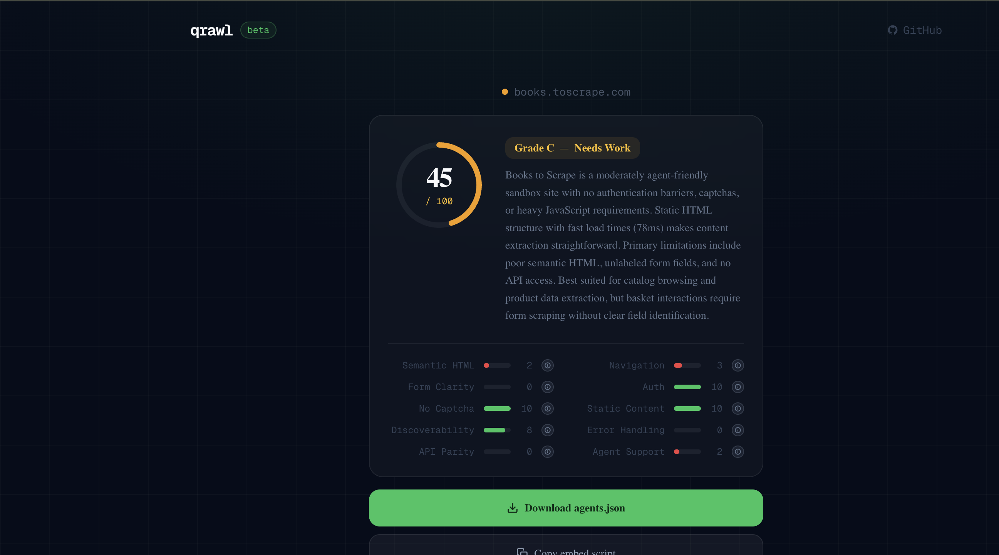
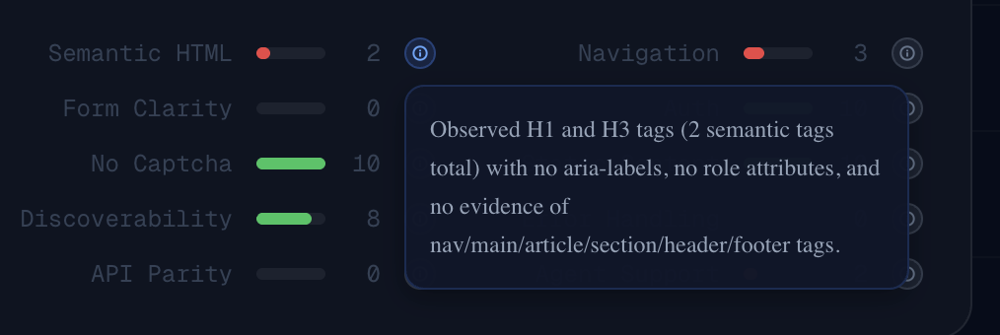
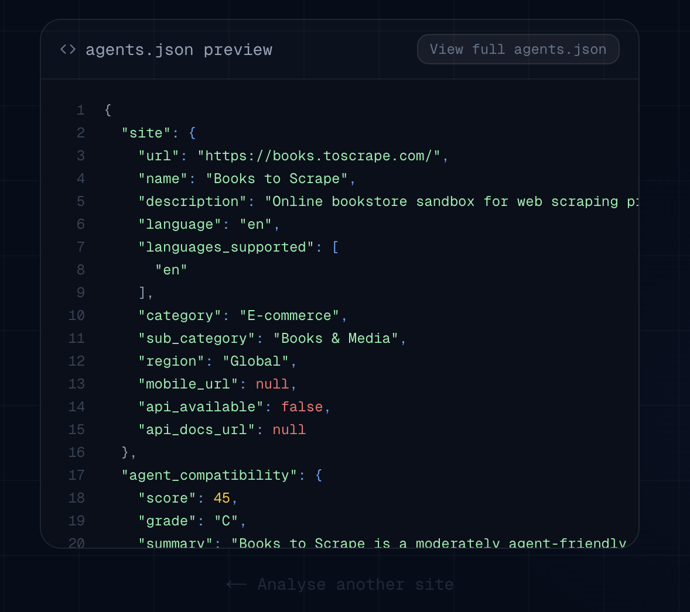

<div align="center">
  
</div>

<br/>

<div align="center">

# 🕷️ Qrawl

### `robots.txt` for the agentic web

**Automatically audit any website and generate `agents.json` — the structured spec that tells AI agents exactly how to navigate it.**

<br/>

[](https://qrawl.onrender.com)
[](https://lablab.ai)
[](https://nextjs.org)
[](https://typescriptlang.org)
[](https://anthropic.com)
[](LICENSE)

</div>

---

## The Problem

The web has **2 billion pages**. All built for humans.

AI agents fail on most of them — not because they're not smart, but because websites were never built for them. No standardized action map. No machine-readable navigation spec. No way to know what's safe to retry, where captchas appear, or how authentication works.

| Standard | Purpose | Year |
|----------|---------|------|
| `robots.txt` | Tells crawlers what NOT to access | 1994 |
| `sitemap.xml` | Tells search engines what pages exist | 2005 |
| **`agents.json`** | **Tells AI agents HOW to navigate** | **2026** |

> **IRCTC** won't even let an agent audit it — so hostile to automation it blocks the crawl entirely. **Amazon** scores ~49/100. The agentic web is broken. Qrawl fixes that.

---

## How It Works

<div align="center">
  
  <p><em>Live crawl in progress — real screenshots stream as Playwright visits each page</em></p>
</div>

<br/>
URL Input
│
▼
Playwright Crawler  ──→  stealth mode, headless Chromium, up to 5 pages
│                     captures screenshots streamed live via SSE
▼
Claude Analysis — Pass 1
│  scores 10 categories (0–10 each) with detailed reasoning
▼
Claude Analysis — Pass 2
│  generates complete agents.json from crawl data + scores
▼
Results UI + Download agents.json

---

## Results Dashboard

<div align="center">
  
  <p><em>Score breakdown with circular grade indicator and 10-category bar chart</em></p>
</div>

---

## Collapsible Reasoning Per Category

<div align="center">
  
  <p><em>Every score comes with Claude's exact reasoning — click ℹ️ to expand</em></p>
</div>

---

## agents.json Preview

<div align="center">
  
  <p><em>Syntax-highlighted agents.json — download or copy embed script directly</em></p>
</div>

---

## Real Test Results

| Website | Score | Grade | Key Finding |
|---------|-------|-------|-------------|
| example.com | 71/100 | 🟢 B | Clean structure, highly agent-friendly |
| amazon.in | ~49/100 | 🟡 C | Heavy bot detection, dynamic JS content |
| zerodha.com | 50/100 | 🟡 C | Auth walls block most agent flows |
| books.toscrape.com | ~51/100 | 🟡 C | No API, poor semantic HTML |
| irctc.co.in | BLOCKED | 🔴 F | Hostile to all automation |

---

## 10 Scoring Categories

| Category | What It Measures |
|----------|-----------------|
| 🏷️ Semantic HTML | Are pages structured for machine reading? |
| 🧭 Navigation Clarity | Can an agent find its way around? |
| 📋 Form Clarity | Are forms labelled and machine-readable? |
| 🔐 Auth Friction | How hard is login for agents? |
| 🚫 No Captcha | Does it block automated access? |
| ⚡ Static Content | Is content server-rendered or JS-dynamic? |
| 🔍 Discoverability | Can agents find available actions? |
| ⚠️ Error Handling | Are errors informative for agents? |
| 🔌 API Parity | Are there public endpoints available? |
| 🤖 Agent Support | Any existing agent-friendly features? |

---

## Before vs After Qrawl

**Before** — blind agent, 12 confused steps, 0% success rate
→ Navigate to homepage
→ Look for search input (not found)
→ Try /search (404)
→ Click random nav items
→ Hit auth wall
→ Retry login (form not detected)
→ ... 7 more failed steps

**After** — spec-driven agent using agents.json, 4 clean steps, task complete ✓
→ Load agents.json from qrawl
→ Navigate to best_entry_point
→ Execute browse_catalogue action
→ Extract structured data ✓

---

## Quick Start

```bash
git clone https://github.com/Khatribhavesh05/Qrawl.git
cd Qrawl
npm install
npx playwright install chromium
```

Create `.env.local`:

```env
NEXT_PUBLIC_SUPABASE_URL=your_supabase_url
NEXT_PUBLIC_SUPABASE_ANON_KEY=your_supabase_anon_key
ANTHROPIC_API_KEY=your_anthropic_key
```

```bash
npm run dev
# Open http://localhost:3000
# Paste any URL → watch it crawl live
```

---

## Tech Stack

| Layer | Technology |
|-------|-----------|
| Framework | Next.js 14 + TypeScript |
| UI | Tailwind CSS + shadcn/ui |
| Crawler | Playwright (headless Chromium, stealth mode) |
| AI | Claude API — scoring + agents.json generation |
| Realtime | Server-Sent Events (SSE) — live screenshot streaming |
| Database | Supabase (Postgres) |
| Hosting | Render |

---

## Project Structure
app/
page.tsx                     # Main UI (input → live crawl → results)
api/crawl/stream/route.ts    # SSE streaming endpoint
api/crawl/route.ts           # Regular crawl endpoint
api/analyse/route.ts         # Claude analyser
lib/
crawler/index.ts             # Playwright stealth crawler
crawler/streaming.ts         # Screenshot streaming
analyser/index.ts            # Claude scoring + agents.json generation
demo/before.ts               # Blind agent demo (12 steps)
demo/after.ts                # Spec-driven agent demo (4 steps)
bob_sessions/                  # All 6 IBM Bob sessions + screenshots
screenshots/                   # UI screenshots for this README

---

## Built at IBM Bob Hackathon 2026

Built in **48 hours** solo at the [IBM Bob Hackathon](https://lablab.ai) (May 15–17, 2026) by **Bhavesh Khatri** (Team: Qrew).

IBM Bob served as AI development partner throughout — reviewing the full codebase, improving scoring prompt determinism, fixing bot detection resilience, and ensuring agents.json output consistency. All 6 sessions documented in `bob_sessions/`.

---

## The Open Standard

`agents.json` is proposed as an open web standard.

Like `robots.txt` started as one engineer's idea in 1994 and became universal web infrastructure, `agents.json` aims to become the spec that makes every website navigable for AI agents.

- **MIT licensed** — open for anyone to adopt
- **JSON Schema validator** included at `lib/schema/agents-schema-validator.json`
- **Community contributions welcome** — open an issue to propose schema changes

---

## License

MIT © 2026 [Bhavesh Khatri](https://github.com/Khatribhavesh05)
